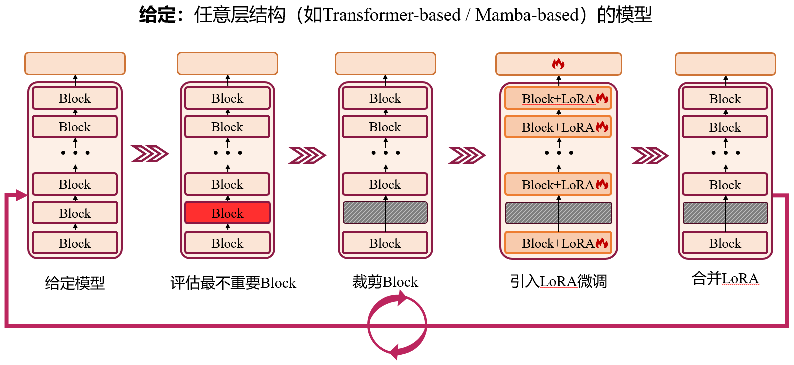

# Temporal Action Detection Model Compression by Progressive Block Drop

The English version of the README is available [here](readme_en.md).

## 简要介绍
这个仓库是论文“Temporal Action Detection Model Compression by Progressive Block Drop”的官方代码实现，我们的论文被CVPR 2025接收，可以在[CVPR 2025](https://openaccess.thecvf.com/content/CVPR2025/html/Chen_Temporal_Action_Detection_Model_Compression_by_Progressive_Block_Drop_CVPR_2025_paper.html)和[arXiv](https://arxiv.org/abs/2503.16916)找到论文和在[YouTube](https://www.youtube.com/watch?v=QhSE8sLffOg)找到视频。

论文提出了一种跨任务、跨模型的**通用模型压缩方法**，在时序动作检测（temporal action detection）任务上验证了其压缩效果。

代码是基于工作[OpenTAD](https://github.com/sming256/OpenTAD)的基础上修改，其数据准备，环境配置，代码架构，运行指令基本一致。该仓库支持Thumos数据集和 (optional) ActivityNet数据集。



## 🛠️ 安装

请按[install.md](docs/en/install.md)准备环境，数据，模型等。

## 指令
 训练指令（默认THUMOS数据集）：
```
bash tools/train.sh
```
 测试指令（默认THUMOS数据集）：
```
bash tools/test.sh
```
lora合并：
```
python tools/model_converters/merge_model.py # 需要在文件里修改输入的参数，在文件里有注释
```
## 重要的代码在下列文件：
```
tools/train_distillation_auto.py # 训练的主函数，其中eval_drop_one_block函数选择drop哪一个block

opentad/models/detectors/actionformer_student.py # 蒸馏的学生模型外层

opentad/models/detectors/actionformer_teacher.py # 蒸馏的教师模型外层

opentad/models/backbones/vit_longlora_student.py # 蒸馏的学生模型内层

opentad/models/backbones/vit_teacher.py # 蒸馏的教师模型内层
```
## （optional）更深层的模型压缩
videomae-small是12层，videomase-large是24层。
在越深层，越大的模型上压缩效果会越好，如果您打算在videomae-large上尝试压缩，按照[train.sh](tools/train.sh)里的说明：
1. 下载videomae-large的预训练权重 [下载链接](https://github.com/sming256/OpenTAD/tree/main/configs/adatad#prepare-the-pretrained-videomae-checkpoints)
2. 在Thumos数据集上微调一个完整无压缩的baseline，使用[配置文件](configs/adatad/videomae/e2e_thumos_videomae_l_768x1_160_longlora.py)，需要修改一处地方（有注释：# you need to change it to your own path）
3. 压缩，使用[配置文件](configs/adatad/videomae/e2e_thumos_videomae_l_768x1_160_LongLoRA_distillation_auto.py)，需要修改两处地方（有注释：# you need to change it to your own path）

## （optional）其它数据集
这个仓库也给了ActivityNet数据集的配置文件，如果您打算在videomae-small上尝试压缩，按照：
1. 下载videomae-small的预训练权重 [下载链接](https://github.com/sming256/OpenTAD/tree/main/configs/adatad#prepare-the-pretrained-videomae-checkpoints)
2. 在ActivityNet数据集上微调一个完整无压缩的baseline，使用[配置文件](configs/adatad/videomae/e2e_anet_videomae_s_768x1_160_LongLoRA.py)，需要修改一处地方（有注释：# you need to change it to your own path）。我们微调的模型在[这里](https://pan.baidu.com/s/1Z2fkI_24vX6hchsJlQhZnA?pwd=tpbd)。
3. 压缩，使用[配置文件](configs/adatad/videomae/e2e_anet_videomae_s_768x1_160_LongLoRA_distillation_auto.py)，需要修改的两处地方（有注释：# you need to change it to your own path）。我们压缩的模型在[这里](https://pan.baidu.com/s/1xFP1lL5-AxwiwYPGzE34ng?pwd=tpbd)。

## 联系方式
如果您对于代码或论文有任何问题，欢迎通过论文首页的邮箱联系我们